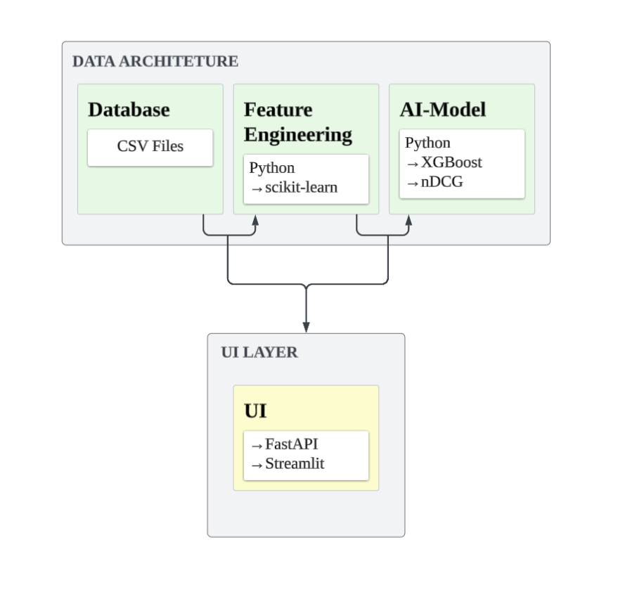
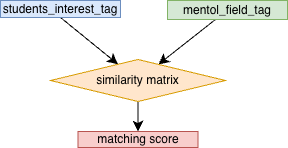
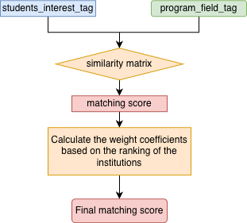
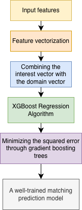
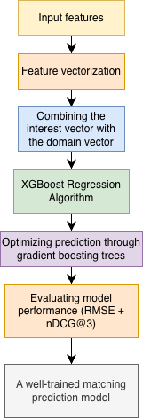
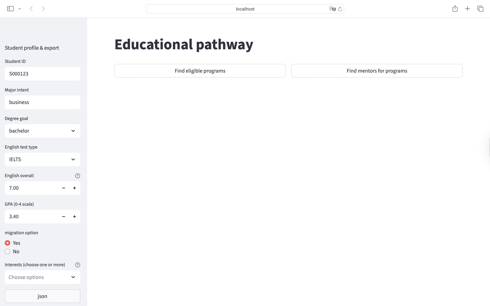
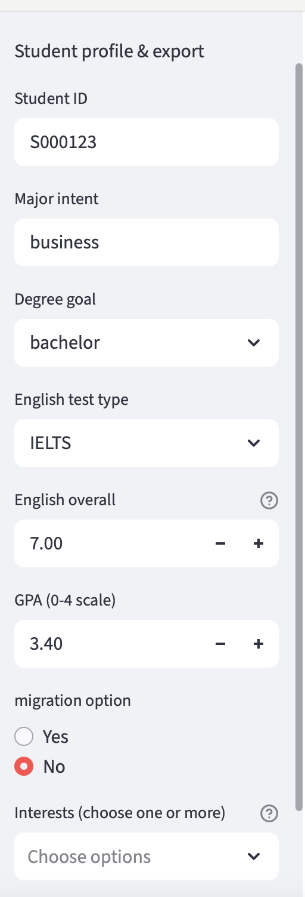
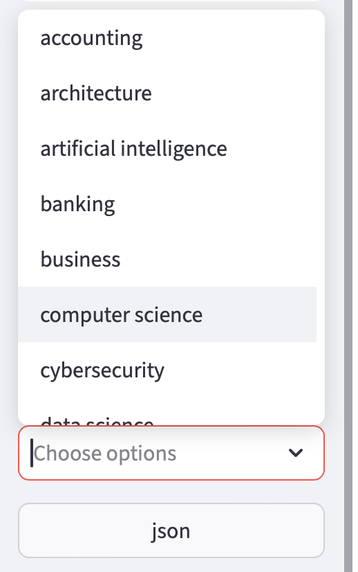
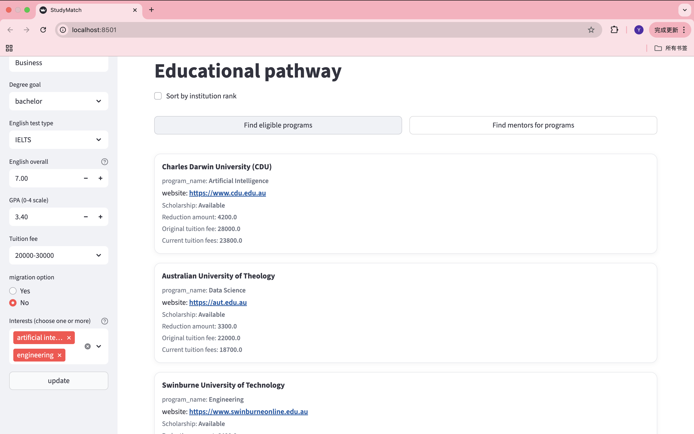

 <h1 align="center" style="font-size:45px; font-weight:bold;">AI-Powered Prediction Platform for Study Pathways and Mentorship</h1>

<a href="#background--motivation" styple="color:#1E90FF; text-decoration:underline;">Background &amp;&amp; Motivation</a>&nbsp;&nbsp;&nbsp;
<a href="#background--motivation" styple="color:#1E90FF; text-decoration:underline;">Overview</a>&nbsp;&nbsp;&nbsp;
<a href="#background--motivation" styple="color:#1E90FF; text-decoration:underline;">Project scope</a>&nbsp;&nbsp;&nbsp;
<a href="#background--motivation" styple="color:#1E90FF; text-decoration:underline;">Methodology</a>&nbsp;&nbsp;&nbsp;
<a href="#background--motivation" styple="color:#1E90FF; text-decoration:underline;">User Interface</a>&nbsp;&nbsp;&nbsp;
 

 

<h2>Background & Motivation</h2> 
<h3 style = "padding: 5px">Background</h3>
<ul>
 <li>International student numbers are rapidly increains, creating demand for personlized guidance.</li>
 <li>Existing advisory tools remain generic, manual, and lack scalability.</li>
 <li>There is a growing need for intelligent, data-driven systems that can provide personlized support.</li>
</ul>

<h3 style = "padding: 5px">Motivation</h3>
<ul>
 <li>Overcomes the limitations of manual and generic advisory tools</li>
 <li>Builds an <b>AI-driven system</b> that provides personalized and scalable study guidance</li>
</ul>

<h2>Overview</h2> 

🔍 Addresses the limitations of manual and generic advisory systems by providing data-driven, personalized study recommendations.

<ul>
  <li>Develops an <b>recommendation system platform based on regression model</b> connecting students with mentors and programs.</li>
  <li>Implements matching models using <b>KNN, XGBoost,</b> and <b>RandomForest</b>.</li>
  <li>Integrates datasets on <b>majors, scholarships, interests,</b> and <b> QS rankings</b>.</li>
  <li>Provides two modes: <b>PR mode</b> and <b>Non-PR mode</b>.</li>
 <li>Evaluates results using <b>nDCG@3 metrics</b>.</li>
</ul>

🎯 Enhances study decision-making by improving recommendation accuracy and scalability.

 

<h2>Project Scope</h2> 

<ul>
<li>Synthetic Data creation: Generate a synthetic dataset representing students, mentors, and institutions.</li>

<li>AI Recommendation Model Development:  Maching algorithms using machine learning models such as KNN, XGBoost, and Random Forest.</li>

<li>Data Integration: Integrate diverse datasets – including majors, scholarships, interests, and QS rankings –as input features for the recommendation system.</li>

<li>Prototype Implementation: A user interface is developed to visually present recommendation results.</li> 

<li>Evaluation: Model performance is compared using accuracy and relevance metrics (nDCG@3, diversity, interpretability).</li>
</ul>

<h3 style = "padding: 5px">Tool & Architecture</h3>

  

<h2>Methodology</h2>

  

 

  

 
<!-- 

  

 

  

 -->

<h2>User Interface</h2> 

  

  

  

  

  

<h2>Clear setup and run instructions</h2> 
<ul>
 <li>Before running the project, first ensure that Python 3.11 is installed on your device and select this version.</li>
</ul>

